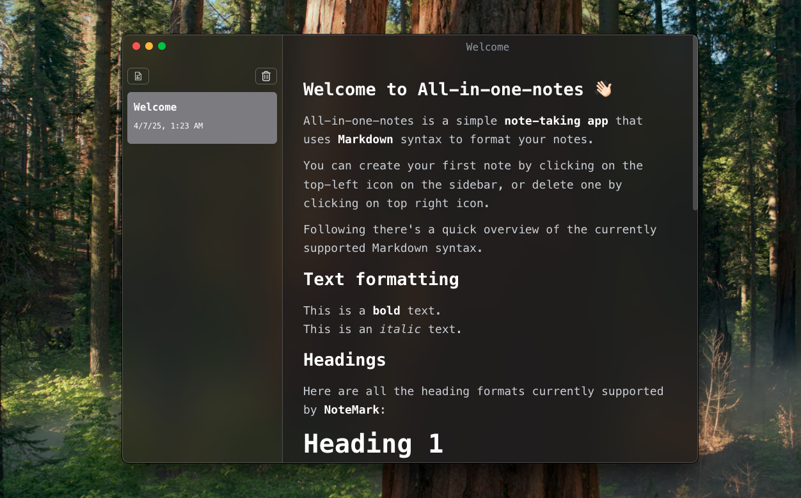
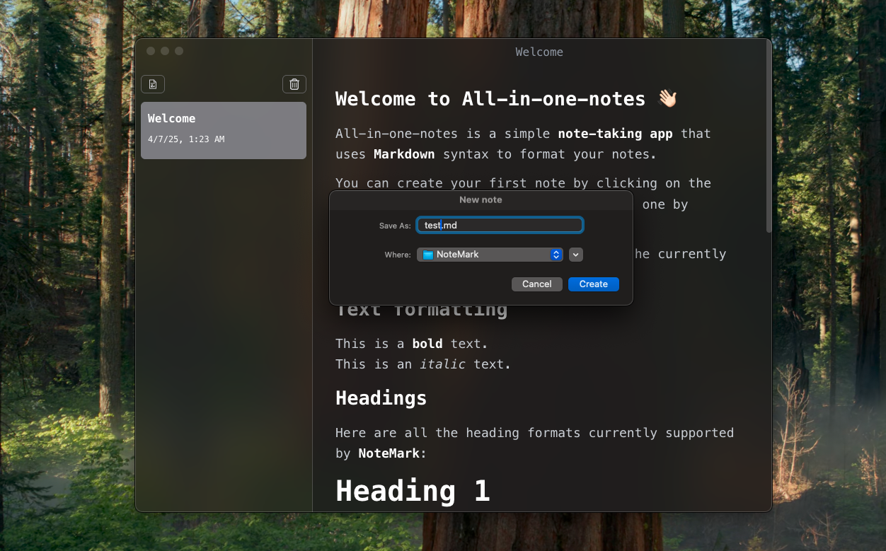
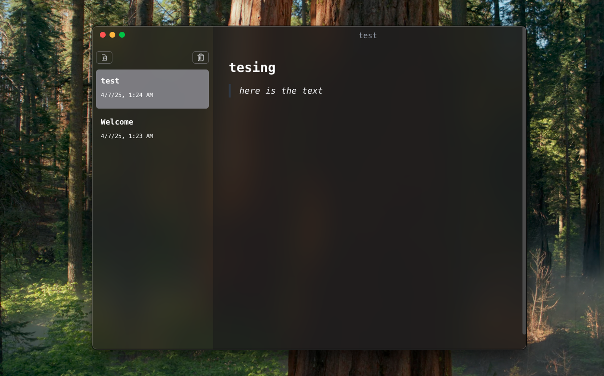
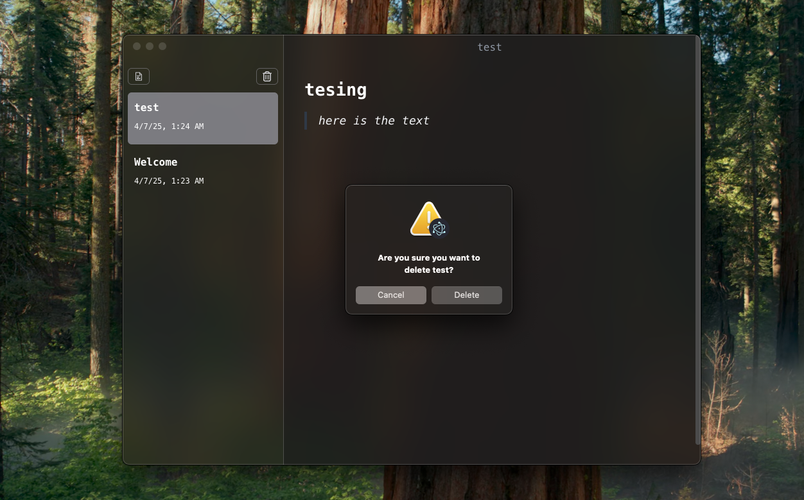

# All-in-one-notes

**Cross-platform text editing (Markdown) software** designed to function like a notes app, but with a **modern user interface**.

## Screenshots









## Inspiration

This application is inspired by [@CodeWithGionatha Labs](https://github.com/CodeWithGionatha). A huge thanks to him for the inspiration!

## Features

- **Markdown Support**: Easily create and edit notes in Markdown format.
- **Cross-Platform**: Runs seamlessly on Windows, macOS, and Linux.
- **Modern UI**: A clean and intuitive user interface for a great user experience.

## Installation

1. Clone this repository:
   ```bash
   git clone https://github.com/yourusername/all-in-one-notes.git

2. Navigate to the project directory:
   ```bash
   cd all-in-one-notes

3. Install dependencies:
   ```bash
   npm install

4. Start the application:
   ```bash
   npm start

## Usage

    1. Launch the application.
    2. Create a new note or open an existing one.
    3. Use Markdown syntax to format your text.
    4. Save your notes and access them anytime!